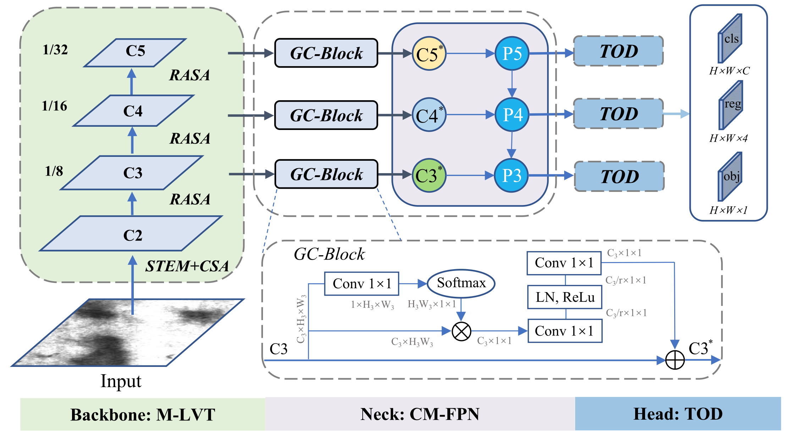
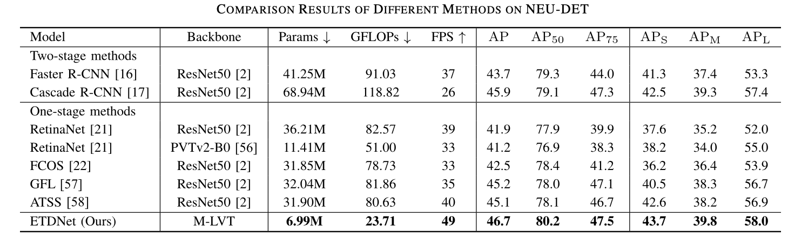
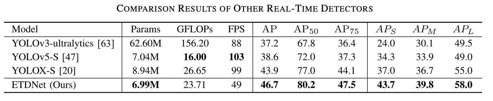
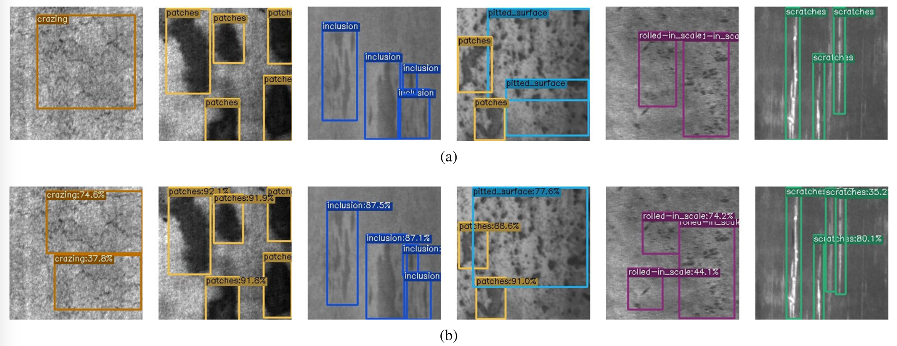

# [IEEE TIM] ETDNet for Surface Defect Detection

## :loudspeaker: Introduction
This is the official implementation of our paper titled "ETDNet: Efficient Transformer-Based Detection Network for Surface Defect Detection". This paper has been accepted by IEEE Transactions on Instrumentation and Measurement (IEEE TIM). 

For more details, please refer to our [paper](https://ieeexplore.ieee.org/abstract/document/10227321). This repo is based on PyTorch.



## :open_file_folder: Datasets and Weight
We release NEU-DET dataset used in this paper, including VOC style and COCO style. Note that five-flod cross-validation is used to divide the dataset.

Download the dataset(s) from corresponding links below.
 - NEU-DET: [Google Drive](https://drive.google.com/drive/folders/1m0qVeSlcugL2VgLMjm6xHcJdxfoPphjB?usp=drive_link); [BaiduNetDisk](https://pan.baidu.com/s/1moXNI4dXpvxn-jxSZMN-zw?pwd=ty4t)

The COCO pretrained weight of our ETDNet:
 - ETDNet Weight: [Google Drive](https://drive.google.com/file/d/1XvVbfRJJFJd5jEkhfyvwZDHGj2Rw5rAs/view?usp=drive_link); [BaiduNetDisk](https://pan.baidu.com/s/1-c_-Jb6WFjSFXqjV98FtCA?pwd=iug2)


## 🚀 Training
More configuration please see tools/mytrain.py and exps/neu_det/etdnet_neu_flod1.py, where you can set device num, dataset path, batch size, weight path, and so on.
```
python3 tools/mytrain.py -f exps/neu_det/etdnet_neu_flod1.py -d 4 -b 16 -c weigth/etdnet.pth --fp16
```

## :trophy: Result
Our ETDNet achieves excellent performance on the NEU-DET dataset and is more lightweight and efficient.


The detection accuracy of our method is much higher than that of the yolo series.


## :ferris_wheel: Visualization

Examples of detection results obtained by the proposed ETDNet on NEU-DET dataset. (a) Ground truth; (b) Prediction images by ETDNet.


## 📚  Citation
Please cite our work if you find our work and codes helpful for your research.
```
@article{zhou2023etdnet,
  title={ETDNet: Efficient Transformer-based Detection Network for Surface Defect Detection},
  author={Zhou, Hantao and Yang, Rui and Hu, Runze and Shu, Chang and Tang, Xiaochu and Li, Xiu},
  journal={IEEE Transactions on Instrumentation and Measurement},
  year={2023},
  publisher={IEEE}
}
```

## Acknowledgement

This project is built upon numerous previous projects. We'd like to thank the contributors of [YOLOX](https://github.com/Megvii-BaseDetection/YOLOX).

